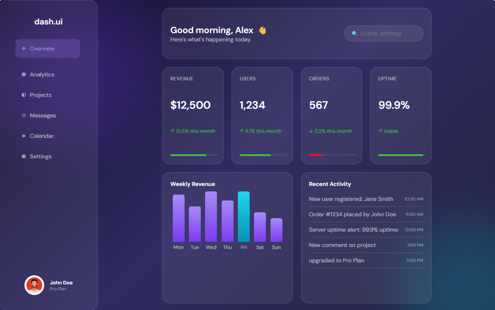

# Financials Dashboard design

This project was created for me to practice my HTML and CSS knowledge. On my learning journey i will add more features as my knowledge expands with javascript and other methids.

## Technologies used

- HTML
- CSS
- Git
- Git Hub

## Key concepts Practiced 

- HTML Semantic
- CSS structuring
- Accessibility
- UI features
- box models
- grids
- flex box
- Aria
- animations
- Glassmorphism designs

## How to view it

open the index.html file in a broswer

## ScreenShots

